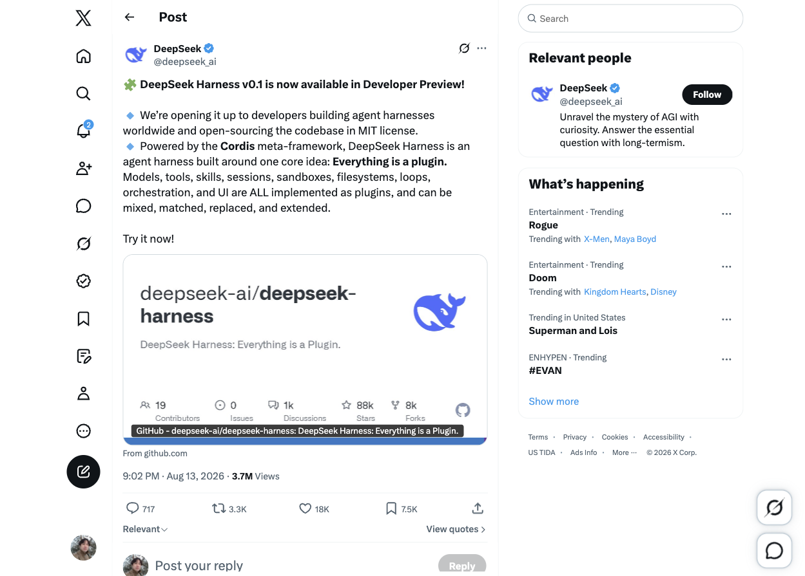
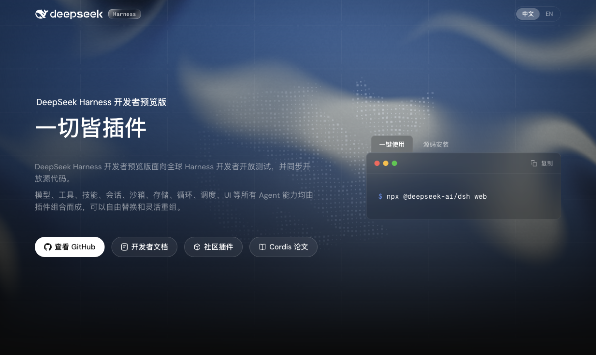
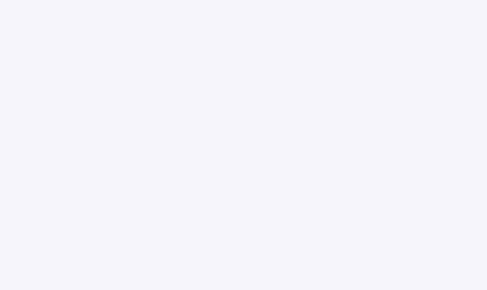

# awesome-deepseek-harness-plugin

DeepSeek Harness / DSH 插件生态的公开资料聚合 repo：把 GitHub 仓库、Hacker News、X、小红书、YouTube、哔哩哔哩、Reddit、知乎、微信公众号、LINUX DO、V2EX、微博和开放网页统一到一个可回溯索引。

从 [docs/index.md](docs/index.md) 开始浏览；[docs/timeline.md](docs/timeline.md) 是时间轴，[docs/categories.md](docs/categories.md) 是启发式归类，[docs/report.html](docs/report.html) 是带 SVG 图表和高关注条目的富媒体报告。

## 当前快照

本地 SQLite 当前包含 **581 条去重记录**、**14 个来源平台**、**744 条指标历史**、**550 个媒体资产引用**和 **65 份 raw JSON**。互动指标按平台原生字段保存：stars、forks、likes、replies、reposts、comments、bookmarks、views、points、favorites、shares、coins、danmaku、upvote_ratio；未显示的数字保持 `NULL`。

| 来源 | 去重记录 | 采集内容 |
| --- | ---: | --- |
| GitHub | 435 | 官方仓库、`dsh-plugin` topic、搜索候选、stars/forks/issues |
| X | 43 | 公开帖子、图片/视频链接、replies/reposts/likes/bookmarks/views |
| Hacker News | 26 | 精确短语与扩展搜索、points/comments、帖子链接 |
| 小红书 | 25 | 搜索卡片、作者、相对时间、点赞、缩略图；详情页限制保留在 provenance |
| Open Web | 21 | 文章/教程/报道的公开元数据和摘要 |
| YouTube | 13 | 视频标题、频道、观看数、视频链接和缩略图 |
| 哔哩哔哩 | 6 | 视频元数据、播放/点赞/投币/收藏/转发/弹幕/评论 |
| Reddit、LINUX DO、官方站、V2EX、微信公众号、微博、知乎 | 12 | 讨论、文章、问答和公开页面补充证据 |

## 数据模型

```text
sources ──< observations ──< item_observations >── items ──< metrics
                                                     ├──< media_assets
                                                     └──< item_tags >── tags
```

- `items`：以 canonical URL 去重的公开对象。
- `observations`：平台、查询、来源 URL、采集时间、方法、状态、raw 文件和 SHA-256。
- `metrics`：按 `item_id + observed_at + metric_source` 去重的指标历史，不把不同平台计数相加。
- `media_assets`：外部图片、视频、缩略图和文档 URL；默认只保存链接，不镜像受版权保护的媒体。

权威数据库是 [data/aggregator.sqlite3](data/aggregator.sqlite3)，schema 在 [src/schema.sql](src/schema.sql)。

## 图文与视频

首轮公开页面截图放在 `media/screenshots/`，可用于人工复核；外部图片/视频/缩略图 URL 和媒体权利说明在 SQLite 的 `media_assets` 中。示例：






截图、平台原图和作者内容仍受原平台及作者权利约束；本 repo 只做公开资料研究索引。

## 更新

从已审核 raw 重建数据库并刷新 index：

```sh
python3 scripts/collect.py init
python3 scripts/collect.py seed
python3 scripts/build_views.py
python3 scripts/validate.py
```

抓取公开 GitHub/HN API，并可同时导入新的 ego-browser 快照：

```sh
python3 scripts/collect.py update --raw data/raw/new-egolite.json
python3 scripts/build_views.py
```

公开仓库的 [refresh-index workflow](.github/workflows/refresh-index.yml) 每天自动更新 GitHub/Hacker News 公共 API，保留带时间戳的 `data/raw/api/` 快照并提交 SQLite 与派生页面。X、小红书、Reddit 等动态页面不会在 CI 中自动绕过限制，继续通过 ego-browser 保存 raw 后用 `--raw` 导入。

ego-browser 采集约定：只保存公开可见 DOM、标题、作者、页面显示的互动数字、公开链接和缩略图；不绕过登录、验证码、扫码或访问限制。遇到拦截页，raw 保留原始证据，observation 使用 `blocked` 状态，不伪造标题或互动数。

`data/raw/auto/` 只用于后续 API 快照，默认不进入 git；需要发表的快照请复制到日期命名的已审核 raw 文件。

## SQLite 查询示例

```sh
sqlite3 data/aggregator.sqlite3 \
  "SELECT platform, title, stars, likes, views FROM v_latest_metrics ORDER BY COALESCE(stars, likes, views, 0) DESC LIMIT 20;"

sqlite3 data/aggregator.sqlite3 \
  "SELECT event_at, platform, title FROM v_timeline ORDER BY event_at DESC LIMIT 50;"

sqlite3 data/aggregator.sqlite3 \
  "SELECT category, COUNT(*) FROM items GROUP BY category ORDER BY COUNT(*) DESC;"
```

## License

代码和 schema 使用 MIT。采集到的元数据、截图、缩略图、视频和文章仍受各平台条款及原作者权利约束；如需删除或更正，请提交来源 URL 和理由。
