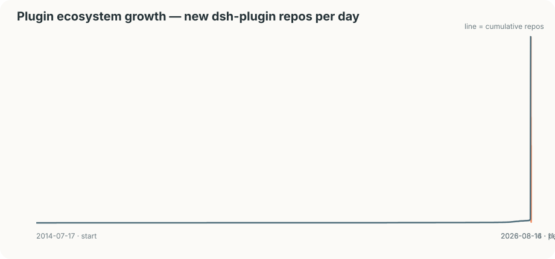
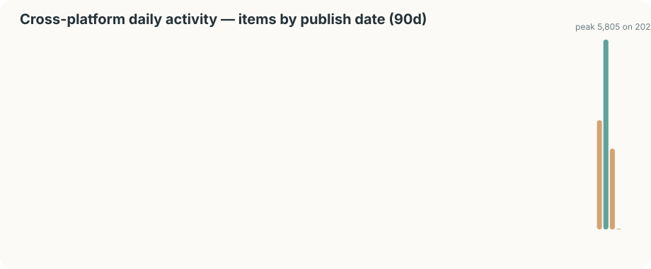
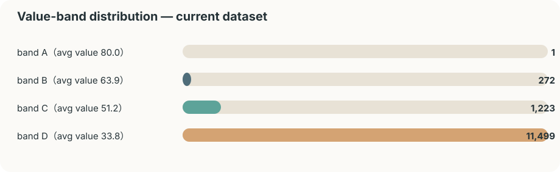
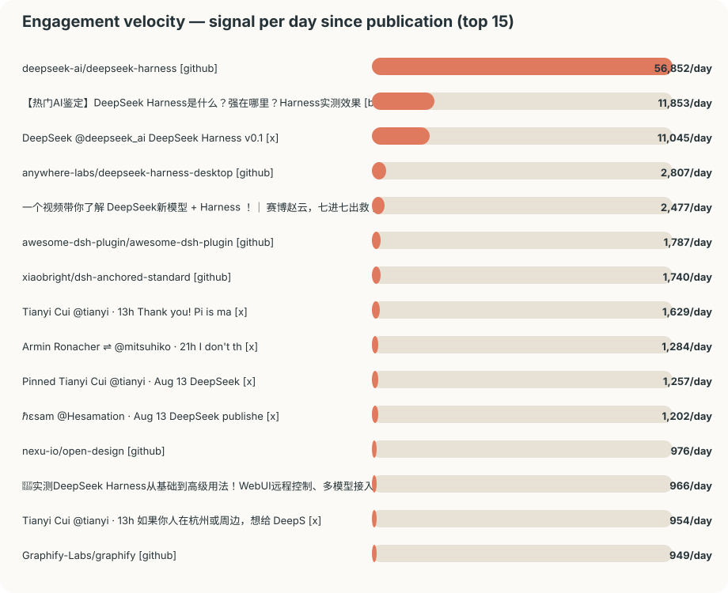

# 趋势 Trends — 生态增长、活跃度与价值分布

> 生成时间 2026-08-20T03:14:43Z。增长曲线来自仓库创建日期；活跃度来自全平台发布日期；价值分布来自当前 value matrix；增量仅在存在多快照时计算。

## 生态增长（GitHub dsh-plugin 仓库/日）

- 开源日 **2026-08-13** 当天新增 **3,305** 个插件仓库；次日再增 5,774 个。
- 累计收录（本库观察到的）**12,905** 个仓库；topic 全量见 `sources` 表。

| 周 | 新增仓库 |
|---|---:|
| 2026-W32 | 12,673 |
| 2026-W31 | 42 |
| 2026-W30 | 6 |
| 2026-W29 | 5 |
| 2026-W28 | 6 |
| 2026-W27 | 5 |

## 全平台活跃度（近 90 天按发布日期）

| 日期 | 条目 |
|---|---:|
| 2026-08-06 | 7 |
| 2026-08-07 | 8 |
| 2026-08-08 | 14 |
| 2026-08-09 | 5 |
| 2026-08-10 | 12 |
| 2026-08-11 | 11 |
| 2026-08-12 | 21 |
| 2026-08-13 | 3,346 |
| 2026-08-14 | 5,815 |
| 2026-08-15 | 2,480 |
| 2026-08-16 | 1,122 |
| 2026-08-17 | 3 |
| 2026-08-18 | 6 |
| 2026-08-19 | 1 |

## 价值分布（当前 dataset）

| 档 | 条目 | 平均 value |
|---|---:|---:|
| A | 2 | 80.6 |
| B | 278 | 64.2 |
| C | 2,228 | 52.9 |
| D | 12,669 | 33.3 |

## 增速榜（互动/天，含价值档）

| 平台 | 条目 | 价值档 | 互动/天 |
|---|---|---|---:|
| github | [deepseek-ai/deepseek-harness](https://github.com/deepseek-ai/deepseek-harness) | B | 30,826 |
| x | [DeepSeek Harness v0.1 is now available in Developer Preview!](https://x.com/deepseek_ai/status/2087887408440164663) | B | 4,058 |
| bilibili | [【热门AI鉴定】DeepSeek Harness是什么？强在哪里？Harness实测效果如何？一口气搞懂！](https://www.bilibili.com/video/BV11CgF6uE4k) | C | 3,511 |
| github | [anywhere-labs/deepseek-harness-desktop](https://github.com/anywhere-labs/deepseek-harness-desktop) | B | 2,625 |
| github | [awesome-dsh-plugin/awesome-dsh-plugin](https://github.com/awesome-dsh-plugin/awesome-dsh-plugin) | B | 2,003 |
| github | [nexu-io/open-design](https://github.com/nexu-io/open-design) | B | 965 |
| github | [Graphify-Labs/graphify](https://github.com/Graphify-Labs/graphify) | B | 935 |
| bilibili | [一个视频带你了解 DeepSeek新模型 + Harness ！｜ 赛博赵云，七进七出救阿斗。](https://www.bilibili.com/video/BV1qFuf6SEEX) | C | 797 |
| github | [zhu1090093659/dsh-web-ui](https://github.com/zhu1090093659/dsh-web-ui) | A | 699 |
| github | [xiaobright/dsh-anchored-standard](https://github.com/xiaobright/dsh-anchored-standard) | B | 695 |
| x | [Pinned Tianyi Cui @tianyi · Aug 13 DeepSeek Harness was just](https://x.com/tianyi/status/2087888089759015218) | B | 449 |
| x | [DeepSeek published their harness. 24K stars already. it’s a ](https://x.com/Hesamation/status/2087917006448173519) | B | 430 |
| x | [Tianyi Cui @tianyi · 13h Thank you! Pi is many DeepSeek rese](https://x.com/tianyi/status/2088306143772946499) | C | 359 |
| github | [diegosouzapw/OmniRoute](https://github.com/diegosouzapw/OmniRoute) | B | 348 |
| github | [ccch1mneyyy/dsh-TUI](https://github.com/ccch1mneyyy/dsh-TUI) | B | 346 |

## 快照增量（GitHub stars，需 ≥2 次观测）

| 仓库 | 快照数 | Δstars |
|---|---:|---:|
| [deepseek-ai/deepseek-harness](https://github.com/deepseek-ai/deepseek-harness) | 76 | +67,132 |
| [anywhere-labs/deepseek-harness-desktop](https://github.com/anywhere-labs/deepseek-harness-desktop) | 75 | +12,467 |
| [awesome-dsh-plugin/awesome-dsh-plugin](https://github.com/awesome-dsh-plugin/awesome-dsh-plugin) | 134 | +8,514 |
| [dsh-routing-suite](https://github.com/yjh051108/dsh-routing-suite) | 3 | +4,098 |
| [diegosouzapw/OmniRoute](https://github.com/diegosouzapw/OmniRoute) | 65 | +3,166 |
| [nexu-io/open-design](https://github.com/nexu-io/open-design) | 74 | +2,900 |
| [zhu1090093659/dsh-web-ui](https://github.com/zhu1090093659/dsh-web-ui) | 75 | +2,797 |
| [xiaobright/dsh-anchored-standard](https://github.com/xiaobright/dsh-anchored-standard) | 75 | +2,624 |
| [Tiger3807861189/J-Space-Cognition-Suite-V3.6](https://github.com/Tiger3807861189/J-Space-Cognition-Suite-V3.6) | 42 | +2,329 |
| [Graphify-Labs/graphify](https://github.com/Graphify-Labs/graphify) | 65 | +1,957 |

## 采集运行历史

| dataset | 时间 | 触发 | 状态 | raw 文件 | item 观测 |
|---|---|---|---|---:|---:|
| v20260820T031438Z | 2026-08-20T03:14:38Z | scheduled | succeeded | 1 | 264 |
| v20260820T031428Z | 2026-08-20T03:14:28Z | source-monitor | succeeded | 1 | 12 |
| v20260820T015509Z | 2026-08-20T01:55:09Z | scheduled | succeeded | 1 | 262 |
| v20260820T015459Z | 2026-08-20T01:54:59Z | source-monitor | succeeded | 1 | 9 |
| v20260819T224916Z | 2026-08-19T22:49:16Z | scheduled | succeeded | 1 | 265 |
| v20260819T224905Z | 2026-08-19T22:49:05Z | source-monitor | succeeded | 1 | 8 |
| v20260819T205216Z | 2026-08-19T20:52:16Z | scheduled | succeeded | 1 | 259 |
| v20260819T205204Z | 2026-08-19T20:52:04Z | source-monitor | succeeded | 1 | 8 |

## 如何持续追踪

- `make update`：抓取 GitHub/HN API 并追加指标快照（metrics 按 observed_at 去重，天然形成时间序列）。
- `make schedule`：运行 source monitor + 全量重建（采集运行历史随之增长）。
- `python3 scripts/build_trends.py`：本页与 4 张 SVG 重新生成。
