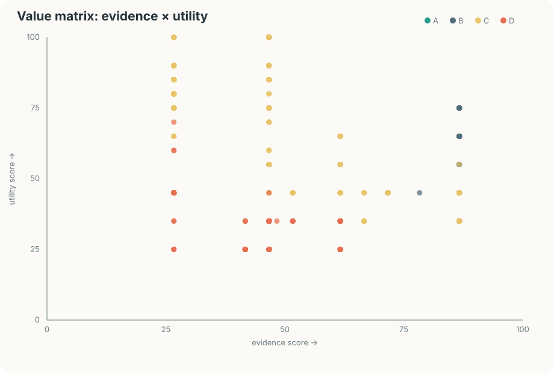

# Value matrix

价值矩阵衡量“值得进一步研究/采用的信号”，不是质量认证、销量排名或安全审计。热度与价值分开：traction 只在同一平台内归一化，其他维度负责补充可用性、证据和生态连接。

## 当前高价值记录

| # | 平台 | 记录 | value | band | utility | evidence | traction | ecosystem | freshness | reviewability | confidence | 风险提示 |
| ---: | --- | --- | ---: | :---: | ---: | ---: | ---: | ---: | ---: | ---: | ---: | --- |
| 1 | github | [zhu1090093659/dsh-web-ui](https://github.com/zhu1090093659/dsh-web-ui) | 80.88 | A | 75.00 | 86.67 | 70.00 | 82.00 | 100.00 | 85.00 | 100.00 | license_unreported |
| 2 | github | [liustack/modlens](https://github.com/liustack/modlens) | 80.23 | A | 75.00 | 86.67 | 66.75 | 82.00 | 100.00 | 85.00 | 100.00 | license_unreported |
| 3 | github | [omdsh-dev/DSH-better-sidebar](https://github.com/omdsh-dev/DSH-better-sidebar) | 79.66 | B | 75.00 | 86.67 | 63.87 | 82.00 | 100.00 | 85.00 | 100.00 | license_unreported |
| 4 | github | [ccch1mneyyy/dsh-TUI](https://github.com/ccch1mneyyy/dsh-TUI) | 79.48 | B | 75.00 | 86.67 | 62.98 | 82.00 | 100.00 | 85.00 | 100.00 | license_unreported |
| 5 | github | [deepseek-ai/deepseek-harness](https://github.com/deepseek-ai/deepseek-harness) | 79.24 | B | 45.00 | 86.67 | 99.28 | 82.00 | 100.00 | 85.00 | 100.00 | license_unreported |
| 6 | github | [ysr666/dsh-vision-router](https://github.com/ysr666/dsh-vision-router) | 77.93 | B | 75.00 | 86.67 | 55.25 | 82.00 | 100.00 | 85.00 | 100.00 | license_unreported |
| 7 | github | [Anionex/dsh-vision-toolkit](https://github.com/Anionex/dsh-vision-toolkit) | 77.78 | B | 75.00 | 86.67 | 54.50 | 82.00 | 100.00 | 85.00 | 100.00 | license_unreported |
| 8 | github | [bowenliang123/dsh-context](https://github.com/bowenliang123/dsh-context) | 76.88 | B | 75.00 | 86.67 | 49.98 | 82.00 | 100.00 | 85.00 | 100.00 | license_unreported |
| 9 | github | [superdesigndev/superdesign-skill](https://github.com/superdesigndev/superdesign-skill) | 76.60 | B | 75.00 | 86.67 | 50.19 | 82.00 | 96.80 | 85.00 | 100.00 | license_unreported |
| 10 | github | [Small-tailqwq/dsh-deep-whale](https://github.com/Small-tailqwq/dsh-deep-whale) | 76.39 | B | 65.00 | 86.67 | 60.04 | 82.00 | 100.00 | 85.00 | 100.00 | license_unreported |
| 11 | github | [omdsh-dev/dsh-at-file](https://github.com/omdsh-dev/dsh-at-file) | 76.33 | B | 75.00 | 86.67 | 49.45 | 82.00 | 95.56 | 85.00 | 100.00 | license_unreported |
| 12 | github | [Lum1104/dsh-browser](https://github.com/Lum1104/dsh-browser) | 76.27 | B | 75.00 | 86.67 | 47.24 | 82.00 | 99.35 | 85.00 | 100.00 | license_unreported |
| 13 | github | [dsh-market/dsh-market](https://github.com/dsh-market/dsh-market) | 76.03 | B | 65.00 | 86.67 | 58.25 | 82.00 | 100.00 | 85.00 | 100.00 | license_unreported |
| 14 | github | [GanyuanRan/Aegis](https://github.com/GanyuanRan/Aegis) | 75.91 | B | 65.00 | 86.67 | 57.65 | 82.00 | 100.00 | 85.00 | 100.00 | license_unreported |
| 15 | github | [csyangwen/dsh-memory-evolve](https://github.com/csyangwen/dsh-memory-evolve) | 75.21 | B | 75.00 | 86.67 | 43.16 | 82.00 | 96.97 | 85.00 | 100.00 | license_unreported |
| 16 | github | [awesome-dsh-plugin/awesome-dsh-plugin](https://github.com/awesome-dsh-plugin/awesome-dsh-plugin) | 75.04 | B | 55.00 | 86.67 | 75.79 | 82.00 | 100.00 | 65.00 | 100.00 | license_unreported |
| 17 | github | [liustack/modsearch](https://github.com/liustack/modsearch) | 74.89 | B | 75.00 | 86.67 | 41.65 | 82.00 | 96.80 | 85.00 | 100.00 | license_unreported |
| 18 | github | [Nagi-ovo/dsh-ads](https://github.com/Nagi-ovo/dsh-ads) | 74.68 | B | 65.00 | 86.67 | 51.50 | 82.00 | 100.00 | 85.00 | 100.00 | license_unreported |
| 19 | github | [linhay/harmony-next.skills](https://github.com/linhay/harmony-next.skills) | 74.59 | B | 75.00 | 86.67 | 47.97 | 72.00 | 96.09 | 85.00 | 100.00 | license_unreported |
| 20 | github | [NanmiCoder/dsh-agent-teams](https://github.com/NanmiCoder/dsh-agent-teams) | 74.52 | B | 65.00 | 86.67 | 52.52 | 82.00 | 96.36 | 85.00 | 100.00 | license_unreported |
| 21 | github | [superdesigndev/treg](https://github.com/superdesigndev/treg) | 74.28 | B | 65.00 | 86.67 | 51.01 | 82.00 | 96.97 | 85.00 | 100.00 | license_unreported |
| 22 | github | [omdsh-dev/dsh-genui](https://github.com/omdsh-dev/dsh-genui) | 74.19 | B | 75.00 | 86.67 | 44.78 | 74.00 | 95.52 | 85.00 | 100.00 | license_unreported |
| 23 | github | [huiliyi37/dsh-tianshu-tui](https://github.com/huiliyi37/dsh-tianshu-tui) | 74.14 | B | 75.00 | 86.67 | 44.52 | 74.00 | 95.52 | 85.00 | 100.00 | license_unreported |
| 24 | github | [volcengine/OpenViking](https://github.com/volcengine/OpenViking) | 73.67 | B | 80.00 | 61.67 | 85.16 | 72.00 | 100.00 | 35.00 | 75.00 | detail_missing, license_unreported |
| 25 | github | [vlln/whale-girl](https://github.com/vlln/whale-girl) | 73.32 | B | 65.00 | 86.67 | 45.38 | 82.00 | 98.57 | 85.00 | 100.00 | license_unreported |
| 26 | github | [hust-open-atom-club/oh-dsh](https://github.com/hust-open-atom-club/oh-dsh) | 73.09 | B | 65.00 | 86.67 | 45.75 | 82.00 | 95.56 | 85.00 | 100.00 | license_unreported |
| 27 | github | [bradeGithub/DSH-Plugins-Marketplace](https://github.com/bradeGithub/DSH-Plugins-Marketplace) | 72.94 | B | 75.00 | 86.67 | 39.85 | 72.00 | 95.90 | 85.00 | 100.00 | license_unreported |
| 28 | github | [Nagi-ovo/dsh-visualize](https://github.com/Nagi-ovo/dsh-visualize) | 72.74 | B | 65.00 | 86.67 | 42.98 | 82.00 | 97.62 | 85.00 | 100.00 | license_unreported |
| 29 | github | [omdsh-dev/dsh-notification](https://github.com/omdsh-dev/dsh-notification) | 72.06 | B | 75.00 | 86.67 | 34.12 | 74.00 | 95.52 | 85.00 | 100.00 | license_unreported |
| 30 | github | [ZSeven-W/dsh-openpencil](https://github.com/ZSeven-W/dsh-openpencil) | 71.97 | B | 65.00 | 86.67 | 39.58 | 82.00 | 96.71 | 85.00 | 100.00 | license_unreported |
| 31 | github | [nexu-io/open-design](https://github.com/nexu-io/open-design) | 71.73 | B | 45.00 | 86.67 | 94.24 | 52.00 | 100.00 | 65.00 | 85.00 | license_unreported |
| 32 | github | [Sanqi-normal/dsh-webui-market-plugin](https://github.com/Sanqi-normal/dsh-webui-market-plugin) | 71.44 | B | 75.00 | 86.67 | 37.02 | 66.00 | 95.52 | 85.00 | 100.00 | license_unreported |
| 33 | github | [titanwings/dsh-automation](https://github.com/titanwings/dsh-automation) | 71.41 | B | 75.00 | 86.67 | 33.85 | 70.00 | 95.52 | 85.00 | 100.00 | license_unreported |
| 34 | github | [icetomoyo/dsh_workflow](https://github.com/icetomoyo/dsh_workflow) | 71.26 | B | 65.00 | 86.67 | 36.54 | 82.00 | 95.72 | 85.00 | 100.00 | license_unreported |
| 35 | github | [Jayden-X-L/forkprobe](https://github.com/Jayden-X-L/forkprobe) | 70.95 | B | 65.00 | 86.67 | 34.89 | 82.00 | 95.90 | 85.00 | 100.00 | license_unreported |
| 36 | github | [Anionex/dsh-turn-rewind](https://github.com/Anionex/dsh-turn-rewind) | 70.67 | B | 65.00 | 86.67 | 36.63 | 78.00 | 95.56 | 85.00 | 100.00 | license_unreported |
| 37 | github | [hairyf/deepseek-harness-desktop](https://github.com/hairyf/deepseek-harness-desktop) | 70.40 | B | 55.00 | 86.67 | 52.57 | 82.00 | 100.00 | 65.00 | 100.00 | license_unreported |
| 38 | github | [zhaoolee/notes](https://github.com/zhaoolee/notes) | 70.40 | B | 65.00 | 86.67 | 41.32 | 70.00 | 95.52 | 85.00 | 100.00 | license_unreported |
| 39 | github | [taxueseek/argo](https://github.com/taxueseek/argo) | 69.78 | B | 65.00 | 86.67 | 38.24 | 70.00 | 95.52 | 85.00 | 100.00 | license_unreported |
| 40 | github | [vlln/plugin-registry](https://github.com/vlln/plugin-registry) | 69.39 | B | 65.00 | 86.67 | 33.28 | 74.00 | 95.52 | 85.00 | 100.00 | license_unreported |
| 41 | github | [omdsh-dev/dsh-annotation](https://github.com/omdsh-dev/dsh-annotation) | 69.32 | B | 65.00 | 86.67 | 35.91 | 70.00 | 95.52 | 85.00 | 100.00 | license_unreported |
| 42 | github | [omdsh-dev/dsh-open-in-vscode](https://github.com/omdsh-dev/dsh-open-in-vscode) | 69.24 | B | 65.00 | 86.67 | 32.51 | 74.00 | 95.52 | 85.00 | 100.00 | license_unreported |
| 43 | github | [Nwflower/dsh-chat-import](https://github.com/Nwflower/dsh-chat-import) | 69.21 | B | 65.00 | 86.67 | 35.36 | 70.00 | 95.52 | 85.00 | 100.00 | license_unreported |
| 44 | github | [Graphify-Labs/graphify](https://github.com/Graphify-Labs/graphify) | 69.05 | B | 45.00 | 86.67 | 95.83 | 32.00 | 100.00 | 65.00 | 85.00 | license_unreported |
| 45 | github | [xiaobright/dsh-anchored-standard](https://github.com/xiaobright/dsh-anchored-standard) | 68.93 | B | 55.00 | 86.67 | 67.73 | 52.00 | 100.00 | 65.00 | 85.00 | license_unreported |
| 46 | github | [tt-a1i/archify](https://github.com/tt-a1i/archify) | 68.71 | B | 45.00 | 86.67 | 79.14 | 52.00 | 100.00 | 65.00 | 85.00 | license_unreported |
| 47 | github | [btspoony/mstar-harness](https://github.com/btspoony/mstar-harness) | 68.60 | B | 65.00 | 86.67 | 32.34 | 70.00 | 95.52 | 85.00 | 100.00 | license_unreported |
| 48 | github | [bytedance/deer-flow](https://github.com/bytedance/deer-flow) | 68.56 | B | 45.00 | 86.67 | 93.37 | 32.00 | 100.00 | 65.00 | 85.00 | license_unreported |
| 49 | github | [diegosouzapw/OmniRoute](https://github.com/diegosouzapw/OmniRoute) | 67.80 | B | 45.00 | 86.67 | 89.58 | 32.00 | 100.00 | 65.00 | 85.00 | license_unreported |
| 50 | zhihu | [怎么看 DeepSeek Harness 正式开源，采用一切皆插件的架构？](https://www.zhihu.com/question/2071348486667237276) | 67.77 | B | 45.00 | 78.33 | 100.00 | 32.00 | 95.57 | 65.00 | 100.00 | — |

## 维度与权重

| 维度 | 权重 | 解释 |
| --- | ---: | --- |
| utility | 25% | 功能与可采用性信号，不等同于安全或质量背书。 |
| evidence | 20% | raw provenance、详情文本、媒体、指标和多次观测的完整度。 |
| traction | 20% | 只在同一平台内以平台原生指标归一化，不跨平台相加。 |
| ecosystem | 15% | 公开生态链接、来源平台和独立观测的连接程度。 |
| freshness | 10% | 以最近一次公开观测时间计算的时间衰减。 |
| reviewability | 10% | README/详情、安装提示、许可证和可审查材料的完整度。 |

## 去重与缺失值规则

- 一条 item 仍以 canonical_url 唯一；同一 raw SHA 只导入一次；同一 item、采集时间和指标来源的 metric 只保留一条。
- 互动数缺失保持 NULL，不会转换成 0；缺失指标只产生 metrics_missing 风险提示并降低证据/置信度。
- 详情抓取按 item_id 幂等；成功详情不会重复请求，blocked/thin/failed 记录保留为 provenance。
- value_assessments 按 item_id + collection_run_id + scoring_version 保存历史评估；同一批次重跑只 upsert，不产生重复评估。

完整逐条矩阵见 index/value-matrix.jsonl，SQLite 查询视图为 v_current_value_matrix。

